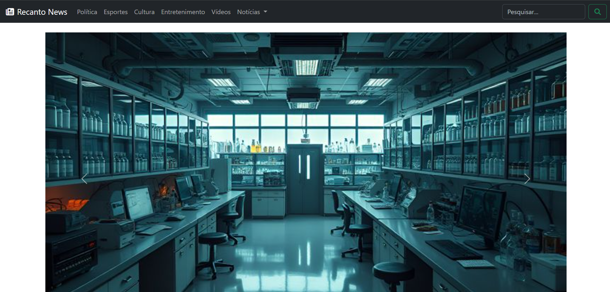

<div align="center">

# Recanto News

Portal de notícias com Bootstrap | News portal built with Bootstrap


[Português (BR)](#pt-br) · [English](#en)



**[Ver demo / Live demo](https://pietrobitencourt.github.io/front-end-web-development/03-recanto-news/)** · **[Voltar ao repositório / Back to repository](../README.md)**

</div>

---

<a id="pt-br"></a>

## Português (BR)

### Contexto

| | |
|---|---|
| **Disciplina** | Desenvolvimento Front-End para Web |
| **Instituição** | Centro Universitário do Distrito Federal (UDF) |
| **Atividade** | Atividade em sala: introdução ao Bootstrap |

### Sobre o projeto

Portal de notícias com tema de ciência, feito em aula para praticar o Bootstrap. O projeto usa o sistema de grid e os componentes prontos do framework, com ícones do Font Awesome, e quase não precisa de CSS próprio.

### Componentes utilizados

| Componente | Onde aparece |
|------------|--------------|
| **Navbar** (`navbar-expand-lg`, tema escuro) | Logo, menu (Política, Esportes, Cultura, Entretenimento, Vídeos), dropdown "Notícias" (Locais, Nacionais, Internacionais) e campo de busca. No celular vira um menu colapsável |
| **Carrossel** (`carousel`) | 3 imagens com setas de navegação e troca automática |
| **Cards** (`card`) | 3 destaques: Pesquisa Científica, Ciência em Laboratório e Química e Elementos |
| **Accordion** (`accordion`) | 3 itens: Novas descobertas científicas, Tecnologia nos laboratórios e Química no cotidiano |
| **Grid** (`container`, `row`, `col-lg-*`) | Layout das seções, com os cards em 3 colunas e o texto ao lado do accordion |
| **Ícones** (Font Awesome) | Logo da navbar e botão de busca |

### Dependências (incluídas no projeto)

O projeto roda sem internet e sem instalação, porque as bibliotecas estão na própria pasta:

| Arquivo | Para que serve |
|---------|----------------|
| `css/bootstrap.min.css` | Estilos do Bootstrap |
| `js/bootstrap.bundle.min.js` | Scripts do Bootstrap (dropdown, carrossel, accordion e menu colapsável), já com o Popper |
| `fontawesome/css/all.min.css` | Estilos dos ícones |
| `fontawesome/webfonts/` | Fontes dos ícones, carregadas pelo CSS acima |

O projeto usa o atributo `data-bs-theme`, então precisa do **Bootstrap 5.3 ou superior**.

### Estrutura

```
03-recanto-news/
├── README.md
├── index.html
├── css/
│   └── bootstrap.min.css
├── js/
│   └── bootstrap.bundle.min.js
├── fontawesome/
│   ├── css/
│   │   └── all.min.css
│   └── webfonts/
├── img/          (imagens do carrossel e dos cards)
└── docs/
    └── screenshots/
        └── capa.png
```

### Como executar

Baixe ou clone o repositório, entre na pasta `03-recanto-news` e abra o `index.html` no navegador. Não precisa instalar nada.

### Possíveis melhorias

- Trocar os `alt="..."` das imagens por descrições reais
- Traduzir os textos "Previous" e "Next" do carrossel
- Usar `h-100` nos cards para igualar a altura
- Adicionar um rodapé e `aria-label` no botão de busca

### Créditos e licenças

- [Bootstrap](https://getbootstrap.com/): licença MIT
- [Font Awesome Free](https://fontawesome.com/): ícones sob CC BY 4.0, fontes sob SIL OFL 1.1 e código sob MIT
- As imagens deste projeto foram encontradas no Pinterest e pertencem aos seus respectivos autores. São usadas somente para fins educacionais. Se você é o autor de alguma imagem e deseja crédito ou remoção, abra uma issue neste repositório.

---

<a id="en"></a>

## English

### Context

| | |
|---|---|
| **Course** | Front-End Web Development |
| **Institution** | Centro Universitário do Distrito Federal (UDF) |
| **Assignment** | In-class exercise: introduction to Bootstrap |

### About

A science-themed news portal built in class to practice Bootstrap. It relies on the framework's grid system and ready-made components, with Font Awesome icons, and needs almost no custom CSS.

### Components used

| Component | Where it appears |
|-----------|------------------|
| **Navbar** (`navbar-expand-lg`, dark theme) | Logo, menu (Politics, Sports, Culture, Entertainment, Videos), "News" dropdown (Local, National, International) and a search field. Collapses into a toggle menu on mobile |
| **Carousel** (`carousel`) | 3 images with navigation arrows and automatic sliding |
| **Cards** (`card`) | 3 highlights: Scientific Research, Science in the Lab and Chemistry and Elements |
| **Accordion** (`accordion`) | 3 items: New scientific discoveries, Technology in labs and Everyday chemistry |
| **Grid** (`container`, `row`, `col-lg-*`) | Section layout, with cards in 3 columns and the text beside the accordion |
| **Icons** (Font Awesome) | Navbar logo and search button |

### Dependencies (included in the project)

The project runs offline with no installation, because the libraries live in the project folder: `css/bootstrap.min.css`, `js/bootstrap.bundle.min.js` (includes Popper), `fontawesome/css/all.min.css` and `fontawesome/webfonts/`.

The project uses the `data-bs-theme` attribute, so it requires **Bootstrap 5.3 or later**.

### Getting started

Download or clone the repository, enter the `03-recanto-news` folder and open `index.html` in your browser. Nothing needs to be installed.

### Possible improvements

- Replace the `alt="..."` placeholders with real descriptions
- Translate the carousel's "Previous" and "Next" labels
- Use `h-100` on cards to equalize their height
- Add a footer and an `aria-label` on the search button

### Credits and licenses

- [Bootstrap](https://getbootstrap.com/): MIT license
- [Font Awesome Free](https://fontawesome.com/): icons under CC BY 4.0, fonts under SIL OFL 1.1 and code under MIT
- The images in this project were found on Pinterest and belong to their respective authors. They are used for educational purposes only. If you are the author of an image and would like credit or removal, please open an issue in this repository.
