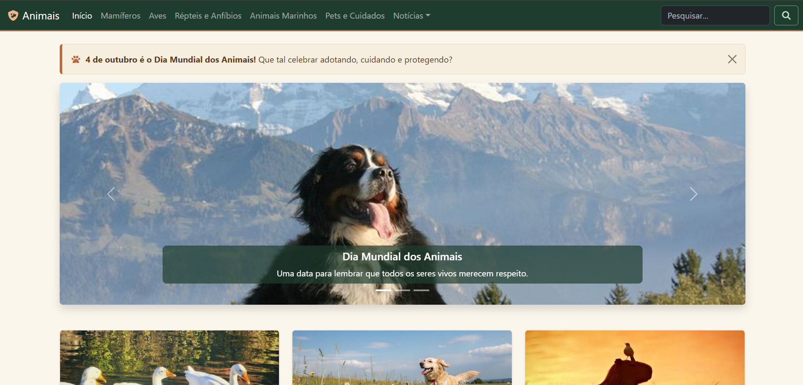
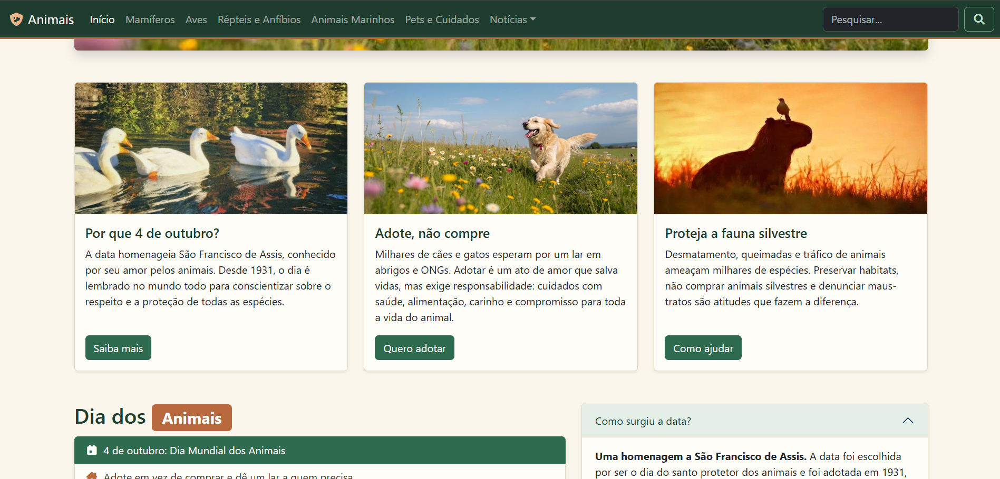
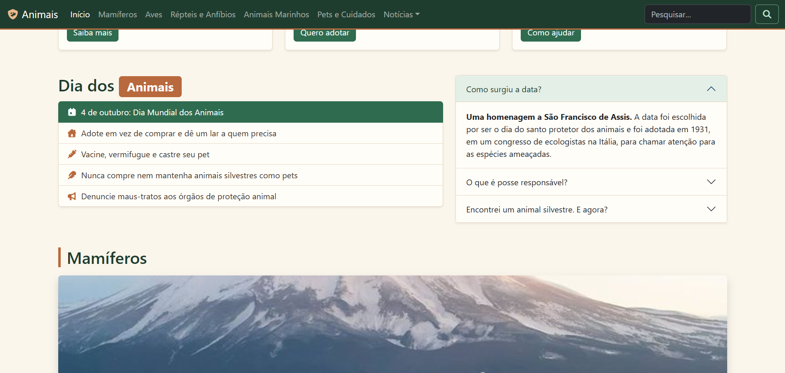
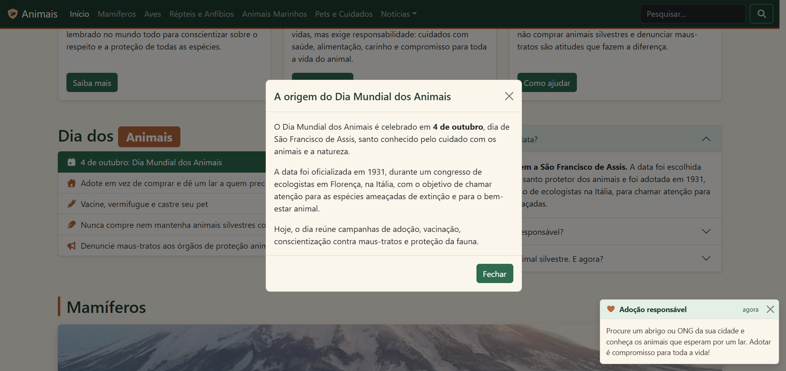

# 🐾 Dia Mundial dos Animais

**🇧🇷 Português** · [🇺🇸 English](#-world-animal-day)


Site responsivo em homenagem ao **Dia Mundial dos Animais (4 de outubro)**, desenvolvido com **Bootstrap 5** como **Prática Avaliativa 02** da disciplina de Desenvolvimento Front-End para Web.

🔗 **Demonstração:** https://pietrobitencourt.github.io/front-end-web-development/04-dia-mundial-animais/

📁 **Repositório geral:** [front-end-web-development](https://github.com/pietrobitencourt/front-end-web-development)

---

## 📋 Sobre a atividade

| | |
|---|---|
| **Instituição** | Centro Universitário do Distrito Federal (UDF) |
| **Disciplina** | Desenvolvimento Front-End para Web |
| **Professor** | Eliel Silva da Cruz |
| **Atividade** | Prática Avaliativa 02 |
| **Tema escolhido** | 04/10: Dia Mundial dos Animais e Dia da Natureza |
| **Requisito** | Site com Bootstrap e no mínimo 7 componentes (Navbar, Carousel, Accordion e Card + 3 outros) |

## 👥 Autores

| Nome | GitHub | LinkedIn |
|---|---|---|
| Piêtro Bitencourt Nunes | [@pietrobitencourt](https://github.com/pietrobitencourt) | [piiettrosz](https://www.linkedin.com/in/piiettrosz/) |
| Zamorano Fragoso de Sousa | [@zamfs](https://github.com/zamfs) | — |

## 🧩 Componentes do Bootstrap utilizados

O requisito pedia 7 componentes. O site utiliza **10**:

| # | Componente | Onde aparece |
|---|---|---|
| 1 | **Navbar** | Menu fixo no topo, com links de âncora para cada seção e busca |
| 2 | **Dropdown** | Item "Notícias" da navbar (Locais, Nacionais, Internacionais) |
| 3 | **Carousel** | Banner principal e carrosséis das seções Mamíferos e Répteis e Anfíbios |
| 4 | **Card** | Três cards: origem da data, adoção responsável e fauna silvestre |
| 5 | **Accordion** | Perguntas sobre a origem da data, posse responsável e animais silvestres |
| 6 | **Alert** | Aviso dispensável no topo da página |
| 7 | **Modal** | Janela "A origem do Dia Mundial dos Animais", aberta pelo botão "Saiba mais" |
| 8 | **Toast** | Mensagem de adoção responsável, exibida ao clicar em "Quero adotar" |
| 9 | **List group** | Lista de dicas para celebrar a data |
| 10 | **Badge** | Destaque no título "Dia dos Animais" |

Também foram usados o sistema de grid (`row`/`col`), botões, utilitários de espaçamento e sombra, e ícones do Font Awesome.

## ✨ Destaques

- Layout responsivo (desktop, tablet e celular)
- Paleta própria em variáveis CSS (verde-floresta, terracota e creme), aplicada sobre o tema do Bootstrap
- Navegação por âncoras com `scroll-margin-top`, para a navbar fixa não cobrir os títulos
- Textos alternativos (`alt`) descritivos em todas as imagens e rótulos de acessibilidade (`aria-label`, `visually-hidden`)
- Pequeno script em JavaScript para exibir o Toast

## 🗂️ Estrutura do projeto

```
04-dia-mundial-animais/
├── index.html
├── README.md
├── css/
│   └── bootstrap.min.css
├── js/
│   └── bootstrap.bundle.min.js
├── fontawesome-free-7.3.1-web/
│   ├── css/all.min.css
│   ├── webfonts/
│   └── LICENSE.txt
├── img/
│   └── 1.jpe ... 10.jpe
└── docs/
    └── screenshots/
```

## 🚀 Como executar

1. Baixe ou clone o repositório.
2. Abra a pasta `04-dia-mundial-animais`.
3. Abra o arquivo `index.html` no navegador. Não é necessário instalar nada nem ter conexão com a internet, pois Bootstrap e Font Awesome estão na própria pasta.

## 🖼️ Capturas de tela

| Início (Navbar, Alert e Carousel) | Cards |
|---|---|
|  |  |

| Lista e Accordion | Modal e Toast |
|---|---|
|  |  |

## 📚 Créditos e licenças

- [Bootstrap 5.3.8](https://getbootstrap.com/): licença MIT
- [Font Awesome Free 7.3.1](https://fontawesome.com/): ícones CC BY 4.0, fontes SIL OFL 1.1 e código MIT (licença completa em `fontawesome-free-7.3.1-web/LICENSE.txt`)

## ⚠️ Aviso sobre as imagens

As imagens utilizadas neste projeto foram obtidas no **Pinterest** e **não são de autoria dos desenvolvedores**. Em muitos casos a autoria original não pôde ser identificada. Todos os direitos pertencem aos seus respectivos autores e proprietários. O uso é **exclusivamente educacional**, sem qualquer fim comercial ou lucrativo. Caso algum autor ou detentor dos direitos queira a remoção ou o crédito de uma imagem, basta abrir uma *issue* neste repositório que o ajuste será feito.

---

# 🐾 World Animal Day

[🇧🇷 Português](#-dia-mundial-dos-animais) · **🇺🇸 English**

A responsive website celebrating **World Animal Day (October 4th)**, built with **Bootstrap 5** as **Graded Practice 02** for the Front-End Web Development course.

🔗 **Live demo:** https://pietrobitencourt.github.io/front-end-web-development/04-dia-mundial-animais/

📁 **Main repository:** [front-end-web-development](https://github.com/pietrobitencourt/front-end-web-development)

## 📋 About the assignment

| | |
|---|---|
| **Institution** | Centro Universitário do Distrito Federal (UDF), Brazil |
| **Course** | Front-End Web Development |
| **Professor** | Eliel Silva da Cruz |
| **Assignment** | Graded Practice 02 |
| **Chosen theme** | October 4th: World Animal Day and Nature Day |
| **Requirement** | A Bootstrap site with at least 7 components (Navbar, Carousel, Accordion and Card + 3 others) |

## 👥 Authors

| Name | GitHub | LinkedIn |
|---|---|---|
| Piêtro Bitencourt Nunes | [@pietrobitencourt](https://github.com/pietrobitencourt) | [piiettrosz](https://www.linkedin.com/in/piiettrosz/) |
| Zamorano Fragoso de Sousa | [@zamfs](https://github.com/zamfs) | — |

## 🧩 Bootstrap components used

The assignment required 7 components. This site uses **10**: Navbar, Dropdown, Carousel, Card, Accordion, Alert, Modal, Toast, List group and Badge. It also relies on the grid system, buttons, spacing and shadow utilities, and Font Awesome icons.

## ✨ Highlights

- Responsive layout (desktop, tablet and mobile)
- Custom color palette built with CSS variables (forest green, terracotta and cream) on top of the Bootstrap theme
- Anchor navigation with `scroll-margin-top`, so the sticky navbar never covers section titles
- Descriptive `alt` text on every image and accessibility labels (`aria-label`, `visually-hidden`)
- A small JavaScript snippet to show the Toast

## 🚀 How to run

1. Download or clone the repository.
2. Open the `04-dia-mundial-animais` folder.
3. Open `index.html` in your browser. Nothing to install and no internet connection needed, since Bootstrap and Font Awesome are bundled in the folder.

## 📚 Credits and licenses

- [Bootstrap 5.3.8](https://getbootstrap.com/): MIT License
- [Font Awesome Free 7.3.1](https://fontawesome.com/): icons CC BY 4.0, fonts SIL OFL 1.1 and code MIT (full license in `fontawesome-free-7.3.1-web/LICENSE.txt`)

## ⚠️ Image notice

The images used in this project were taken from **Pinterest** and are **not the work of the developers**. In many cases the original author could not be identified. All rights belong to their respective authors and owners. They are used for **educational purposes only**, with no commercial or profit-making intent. If any author or rights holder would like an image removed or credited, please open an *issue* in this repository and it will be addressed.
