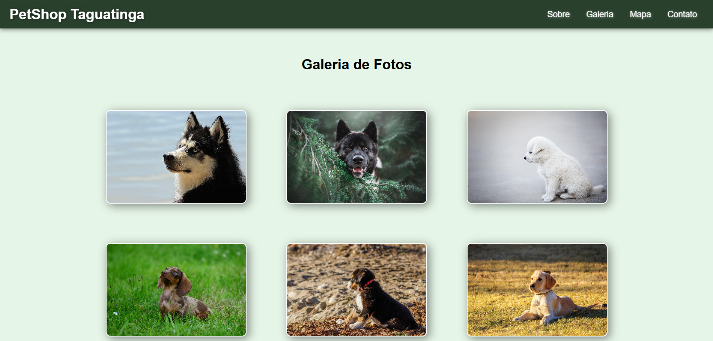
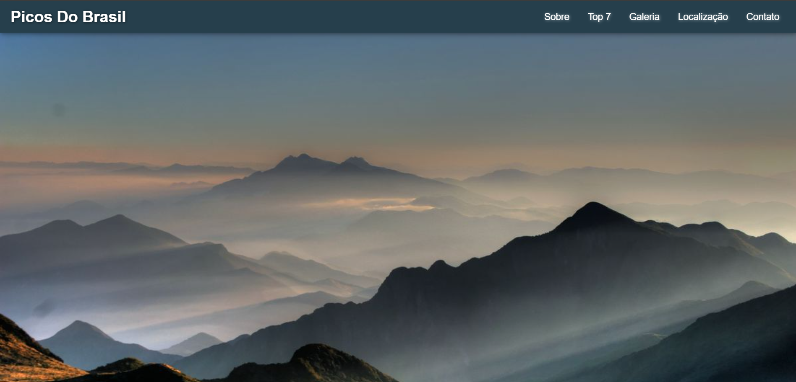

<div align="center">

# Front-End Web Development

**Atividades da disciplina de Desenvolvimento Front-End para Web**
**Coursework from the Front-End Web Development class**


<!--
Descomente os badges abaixo conforme as tecnologias forem sendo usadas:


-->


[Português (BR)](#pt-br) · [English](#en)

</div>

<p align="center">
  <a href="./01-petshop-taguatinga"></a>
  <a href="./02-picos-do-brasil"></a>
  <a href="./03-recanto-news"></a>
</p>

---

<a id="pt-br"></a>

## Português (BR)

### Sobre o repositório

Este repositório reúne as atividades práticas que desenvolvo na disciplina de **Desenvolvimento Front-End para Web**. Cada atividade fica em uma pasta própria, numerada na ordem em que foi feita, com seu próprio README e seus prints, e pode ser aberta direto no navegador, sem etapa de build.

O objetivo é documentar minha evolução, desde HTML e CSS puros até o uso de bibliotecas e novas ferramentas, mantendo cada projeto organizado e fácil de executar. O repositório continua crescendo: novas atividades entram em pastas numeradas (`04-...`, `05-...`) conforme a disciplina avança.

### Contexto acadêmico

| | |
|---|---|
| **Instituição** | Centro Universitário do Distrito Federal (UDF), Brasília - DF |
| **Curso** | Ciência da Computação |
| **Disciplina** | Desenvolvimento Front-End para Web |

### Atividades

| # | Projeto | Descrição | Tecnologias | Demo | Código |
|---|---------|-----------|-------------|------|--------|
| 01 | **PetShop Taguatinga** | Site institucional de uma página só: header fixo com navegação por âncoras, seção hero, galeria de fotos com efeito hover, mapa do Google incorporado e formulário de contato. | HTML5, CSS3 (Flexbox) | [Ver demo](https://pietrobitencourt.github.io/front-end-web-development/01-petshop-taguatinga/) | [Abrir pasta](./01-petshop-taguatinga) |
| 02 | **Picos do Brasil** | Prática Avaliativa 1. Site sobre os 7 picos mais altos do Brasil, com novo item de menu e nova seção "Top 7" (altitude, localização e curiosidades de cada pico), galeria de fotos, mapa incorporado e novo tema de cores. | HTML5, CSS3 (Flexbox) | [Ver demo](https://pietrobitencourt.github.io/front-end-web-development/02-picos-do-brasil/) | [Abrir pasta](./02-picos-do-brasil) |
| 03 | **Recanto News** | Atividade em sala de introdução ao Bootstrap. Portal de notícias com tema de ciência: navbar responsiva com dropdown, carrossel, cards, accordion e layout em grid. | HTML5, Bootstrap 5, Font Awesome | [Ver demo](https://pietrobitencourt.github.io/front-end-web-development/03-recanto-news/) | [Abrir pasta](./03-recanto-news) |

### O que cada atividade pratica

**01 · PetShop Taguatinga**
- Estrutura semântica com `header`, `nav`, `main`, `section` e `footer`
- Layout com Flexbox e unidades relativas (`rem`, `vh`)
- Header fixo, navegação por âncoras e transições (`transition`, `transform`) em hover
- Imagens com `object-fit`, mapa incorporado via `iframe` e formulário de contato

**02 · Picos do Brasil**
- Evolução do projeto 01: novo item de menu, nova seção e troca completa da paleta de cores
- Conteúdo sobre o Brasil organizado em colunas (Flexbox), com altitude e localização de cada pico
- Galeria de fotos, mapa do Google My Maps incorporado e formulário de contato

**03 · Recanto News**
- Sistema de grid do Bootstrap (`container`, `row`, `col-lg-*`)
- Componentes: navbar com menu colapsável e dropdown, carrossel, cards e accordion
- Ícones com Font Awesome
- Tema escuro da navbar com `data-bs-theme`

### Estrutura do repositório

```
front-end-web-development/
├── README.md
├── LICENSE
├── 01-petshop-taguatinga/
│   ├── README.md
│   ├── index.html
│   ├── css/
│   │   └── style.css
│   ├── img/
│   └── docs/
│       └── screenshots/
│           └── capa.png
├── 02-picos-do-brasil/
│   ├── README.md
│   ├── index.html
│   ├── css/
│   │   └── style.css
│   ├── img/
│   └── docs/
│       └── screenshots/
│           └── top-7.png
└── 03-recanto-news/
    ├── README.md
    ├── index.html
    ├── css/
    │   └── bootstrap.min.css
    ├── js/
    │   └── bootstrap.bundle.min.js
    ├── fontawesome/
    │   ├── css/all.min.css
    │   └── webfonts/
    ├── img/
    └── docs/
        └── screenshots/
            └── capa.png
```

### Como executar

1. Clone o repositório:
   ```bash
   git clone https://github.com/SEU-USUARIO/front-end-web-development.git
   ```
2. Entre na pasta da atividade desejada, por exemplo:
   ```bash
   cd front-end-web-development/02-picos-do-brasil
   ```
3. Abra o `index.html` no navegador (ou use a extensão **Live Server** do VS Code).

Não é necessário instalar nada: as dependências da atividade 03 já estão incluídas na pasta do projeto.

### Observações

- Os formulários de contato das atividades 01 e 02 são apenas visuais: não há backend, então nenhuma mensagem é enviada.
- **Imagens:** as da atividade 01 vêm do [Pixabay](https://pixabay.com/); as das atividades 02 e 03 foram encontradas no Pinterest e pertencem aos seus respectivos autores. Todas são usadas somente para fins educacionais. Se você é o autor de alguma imagem e deseja crédito ou remoção, abra uma issue neste repositório.
- A licença MIT cobre apenas o código. As imagens não estão sob essa licença.

### Créditos e licenças de terceiros

- [Bootstrap](https://getbootstrap.com/): licença MIT
- [Font Awesome Free](https://fontawesome.com/): ícones sob CC BY 4.0, fontes sob SIL OFL 1.1 e código sob MIT

### Autor

**Piêtro Bitencourt Nunes**, estudante de Ciência da Computação no Centro Universitário do Distrito Federal (UDF), Brasília - DF.

[](https://github.com/pietrobitencourt)
[](https://www.linkedin.com/in/piiettrosz)

### Licença

Distribuído sob a licença MIT. Veja o arquivo [LICENSE](./LICENSE) para mais detalhes.

---

<a id="en"></a>

## English

### About

This repository collects the hands-on assignments I build in my **Front-End Web Development** class. Each assignment lives in its own numbered folder, in the order it was completed, with its own README and screenshots, and runs straight in the browser with no build step.

The goal is to document my progress, from plain HTML and CSS to libraries and new tools, while keeping every project organized and easy to run. The repository keeps growing: new assignments are added in numbered folders (`04-...`, `05-...`) as the class moves forward.

### Academic context

| | |
|---|---|
| **Institution** | Centro Universitário do Distrito Federal (UDF), Brasília, Brazil |
| **Program** | Computer Science |
| **Course** | Front-End Web Development |

### Projects

| # | Project | Description | Tech | Demo | Code |
|---|---------|-------------|------|------|------|
| 01 | **PetShop Taguatinga** | Single-page business website: fixed header with anchor navigation, hero section, photo gallery with hover effects, embedded Google Map and a contact form. | HTML5, CSS3 (Flexbox) | [Live demo](https://pietrobitencourt.github.io/front-end-web-development/01-petshop-taguatinga/) | [Open folder](./01-petshop-taguatinga) |
| 02 | **Picos do Brasil** | Graded assignment 1. Website about Brazil's 7 highest peaks, with a new menu item and a new "Top 7" section (altitude, location and facts for each peak), photo gallery, embedded map and a new color theme. | HTML5, CSS3 (Flexbox) | [Live demo](https://pietrobitencourt.github.io/front-end-web-development/02-picos-do-brasil/) | [Open folder](./02-picos-do-brasil) |
| 03 | **Recanto News** | In-class introduction to Bootstrap. Science-themed news portal: responsive navbar with dropdown, carousel, cards, accordion and a grid layout. | HTML5, Bootstrap 5, Font Awesome | [Live demo](https://pietrobitencourt.github.io/front-end-web-development/03-recanto-news/) | [Open folder](./03-recanto-news) |

### What each project practices

**01 · PetShop Taguatinga**
- Semantic structure with `header`, `nav`, `main`, `section` and `footer`
- Flexbox layout and relative units (`rem`, `vh`)
- Fixed header, anchor navigation and hover transitions (`transition`, `transform`)
- Images with `object-fit`, an embedded map via `iframe` and a contact form

**02 · Picos do Brasil**
- Builds on project 01: a new menu item, a new section and a complete color palette change
- Content about Brazil laid out in Flexbox columns, with altitude and location for each peak
- Photo gallery, embedded Google My Maps and a contact form

**03 · Recanto News**
- Bootstrap grid system (`container`, `row`, `col-lg-*`)
- Components: collapsible navbar with dropdown, carousel, cards and accordion
- Icons with Font Awesome
- Dark navbar theme using `data-bs-theme`

### Repository structure

See the tree in the Portuguese section above: one numbered folder per project, each with its own README and `docs/screenshots/`.

### Getting started

1. Clone the repository:
   ```bash
   git clone https://github.com/SEU-USUARIO/front-end-web-development.git
   ```
2. Enter the project folder you want, for example:
   ```bash
   cd front-end-web-development/02-picos-do-brasil
   ```
3. Open `index.html` in your browser (or use the VS Code **Live Server** extension).

Nothing needs to be installed: project 03 already ships with its Bootstrap and Font Awesome files.

### Notes

- The contact forms in projects 01 and 02 are visual only: there is no backend, so no message is actually sent.
- **Images:** those in project 01 come from [Pixabay](https://pixabay.com/); those in projects 02 and 03 were found on Pinterest and belong to their respective authors. All are used for educational purposes only. If you are the author of an image and would like credit or removal, please open an issue in this repository.
- The MIT license covers the code only. The images are not under that license.

### Third-party credits and licenses

- [Bootstrap](https://getbootstrap.com/): MIT license
- [Font Awesome Free](https://fontawesome.com/): icons under CC BY 4.0, fonts under SIL OFL 1.1 and code under MIT

### Author

**Piêtro Bitencourt Nunes**, Computer Science student at Centro Universitário do Distrito Federal (UDF), Brasília, Brazil.

[](https://github.com/pietrobitencourt)
[](https://www.linkedin.com/in/piiettrosz)

### License

Distributed under the MIT License. See [LICENSE](./LICENSE) for more information.
